# Glow Social Topical Authority Map for Ranked

Date: 2026-06-11

Use this as an execution blueprint for Ranked. The goal is not to publish the most pages. The goal is to turn Glow Social's existing footprint into clear topical authority around local-business social media, done-for-you content creation, affordable alternatives, Google Business Profile activity, and vertical-specific trust.

## Inputs Used

- Keyword bank: `scripts/generate-blog-posts.js`
- GSC/SEO refresh notes: `seo-republish-queue-2026-06-07.md` and `seo-tracking-2026-06-07.md`
- Existing content inventory: `content/blog`, `content/questions`, `content/comparisons`, `content/local`, `content/research`
- Current competitive spot-check: Buffer, Hootsuite, Sprout Social, Later, plus niche vertical competitors surfaced in search

## Core IA Principle

Do not let Ranked create exact-slug duplicates just because the generator says a keyword has no matching slug. Many keywords already have semantic coverage under different canonical URLs. For each target, Ranked should choose one of three actions:

- `Refresh`: strengthen an existing page and add internal links.
- `Create`: publish a net-new page because no useful semantic match exists.
- `Consolidate`: merge/redirect duplicate or thin pages into the strongest canonical page.

## Authority Map

```mermaid
graph TD
  A["Glow Social: affordable done-for-you social media for local businesses"]
  A --> B["Affordable social media management and cost"]
  A --> C["Scheduler vs content-creation comparisons"]
  A --> D["AI / done-for-you content creation"]
  A --> E["Google Business Profile + local trust"]
  A --> F["Posting strategy, frequency, ROI, platforms"]
  A --> G["Vertical social media service pages"]
  A --> H["Proof, examples, reviews, and real posts"]

  B --> B1["Freelancer / agency / DIY pricing"]
  B --> B2["Budget and true time cost"]
  B --> B3["Is it worth hiring a manager?"]

  C --> C1["Buffer / Later / Hootsuite / Sprout / Metricool"]
  C --> C2["Alternative pages"]
  C --> C3["Scheduling-only vs posts-ready-to-approve"]

  D --> D1["How AI writes posts"]
  D --> D2["Can AI manage accounts?"]
  D --> D3["AI content quality and engagement"]
  D --> D4["Brand voice and business context"]

  E --> E1["GBP setup and posting"]
  E --> E2["Reviews into social proof"]
  E --> E3["AI search / AEO local visibility"]
  E --> E4["Service-area and industry GBP examples"]

  F --> F1["How often to post"]
  F --> F2["Best times and platform choice"]
  F --> F3["ROI, lead generation, trust"]
  F --> F4["Mistakes and stale-profile risk"]

  G --> G1["Home services"]
  G --> G2["Health / beauty / professional services"]
  G --> G3["Restaurants / hospitality / retail"]
  G --> G4["Local vertical-city pages"]

  H --> H1["Real Glow Social posts"]
  H --> H2["Before/after examples"]
  H --> H3["Customer results and reviews"]
```

## Competitive Gap Summary

Large SaaS competitors cover broad social media management, scheduling, tools, content creation, best times, and Google Business Profile basics. Their gap is the local-business execution layer: specific posts by industry, proof from everyday work, reviews, stale-profile risk, and the difference between scheduling a blank calendar and receiving posts ready to approve.

Niche competitors cover some vertical angles, especially dentists, plumbers, roofers, and salons. Their gap is usually breadth and systemization: they often explain what to post, but do not own the full map across cost, AI, GBP, local trust, vertical examples, and comparison intent.

Glow Social should position as the practical middle layer: cheaper than agencies, more complete than schedulers, less generic than ChatGPT, and built for local businesses that need visible proof without managing a content calendar.

## Pillar 1: Affordable Social Media Management and Cost

Primary job: Capture buyers who know they need help but are price-sensitive.

Hub/canonical assets:

- `/affordable-social-media-management`
- `/blog/best-affordable-social-media-management-small-business`
- `/blog/freelance-social-media-manager-charge-cost`
- `/blog/social-media-management-cost-pricing-guide`
- `/tools/social-media-management-cost-calculator`

Supporting subtopics:

- Freelance social media manager rates
- Social media management pricing guide for small business
- How much should I budget for social media management?
- Is hiring a social media manager worth it?
- Agency vs freelancer vs DIY vs done-for-you software
- True time cost of DIY social media
- Cheap vs affordable social media management

Ranked actions:

1. Refresh `/blog/freelance-social-media-manager-charge-cost`; it already has the highest cost-intent signal.
2. Refresh `/blog/social-media-management-cost-pricing-guide`; make it a clean comparison hub, not a duplicate of the freelance page.
3. Strengthen `/affordable-social-media-management`; use it as the transactional hub.
4. Create `/blog/how-much-should-i-budget-for-social-media-management` only if it does not duplicate the pricing guide; angle it around monthly budget ranges and decision rules.
5. Create or refresh `/blog/is-hiring-a-social-media-manager-worth-it-for-small-business`; angle around when a human is worth it versus when baseline consistency is enough.

Internal link pattern:

- Every cost spoke links to `/affordable-social-media-management`, `/blog/freelance-social-media-manager-charge-cost`, and `/tools/social-media-management-cost-calculator`.
- Cost pages should link laterally to comparison pages where the competing option is a scheduler.

## Pillar 2: Scheduler vs Content-Creation Comparisons

Primary job: Intercept tool comparison traffic and reframe the category from "which scheduler?" to "who creates the posts?"

Hub/canonical assets:

- `/blog/later-vs-buffer-differences-comparison`
- `/blog/buffer-pricing-free-plan-limits-2026`
- `/blog/later-pricing-free-plan-2026`
- `/blog/social-media-tools-under-50`
- `/compare`
- `/blog/hootsuite-vs-glow-social`
- `/blog/buffer-vs-glow-social`

Supporting subtopics:

- Later vs Buffer
- Buffer pricing and free plan limits
- Later pricing and social sets
- Metricool vs Hootsuite for small business
- Publer vs Buffer for small business
- Hootsuite alternative cheaper 2026
- Buffer alternative with content creation built in
- Sprout Social alternative for small business
- SocialBee and Zoho Social alternatives for local business

Ranked actions:

1. Refresh `/blog/later-vs-buffer-differences-comparison`; add direct answer table above the fold and link to Buffer/Later pricing.
2. Refresh `/blog/buffer-pricing-free-plan-limits-2026` and `/blog/later-pricing-free-plan-2026`; add "pricing is not the real cost if you still create posts" sections.
3. Refresh `/blog/social-media-tools-under-50`; make it the budget-tool roundup and link to cost calculator.
4. Create `/blog/metricool-vs-hootsuite-for-small-business`; compare heavy dashboard features vs simple local-business needs.
5. Create `/blog/publer-vs-buffer-small-business`; keep it scheduler-first, then introduce creation gap.
6. Create or refresh `/blog/sprout-social-alternative-for-small-business`; position Sprout as too much tool for local operators.
7. Create `/blog/buffer-alternative-with-content-creation-built-in`; high-priority because it names the category gap.

Internal link pattern:

- All scheduler pages link to the "scheduling-only vs content creation" explainer.
- Every comparison page links to one relevant cost page and one relevant industry example.
- Add a small comparison table to the top 150-250 words.

## Pillar 3: AI and Done-For-You Content Creation

Primary job: Own the category definition before competitors define AI social media as generic caption generation.

Hub/canonical assets:

- `/blog/how-ai-social-media-posting-works`
- `/blog/best-ai-social-media-content-generators`
- `/blog/can-ai-write-good-social-media-posts`
- `/blog/social-media-manager-vs-ai`
- `/blog/ai-social-media-tools-scheduling-vs-creation-vs-done-for-you`
- `/social-media-scheduler-that-creates-content`
- `/blog/oba-social-media-framework-local-business`

Supporting subtopics:

- How AI writes social media posts for local business
- Can AI manage your social media accounts for you?
- Does AI social media content actually get engagement?
- AI content with local business context
- Brand voice, reviews, photos, FAQs, and website-to-post workflows
- Done-for-you social media for small business
- What scheduling tools cannot automate

Ranked actions:

1. Refresh `/blog/how-ai-social-media-posting-works`; make this the central explainer.
2. Refresh `/blog/ai-social-media-tools-scheduling-vs-creation-vs-done-for-you`; use it as the category taxonomy.
3. Create `/blog/how-ai-writes-social-media-posts-for-local-business`; focus on source inputs: website, services, FAQs, reviews, photos, location, voice.
4. Create `/blog/can-ai-manage-your-social-media-accounts-for-you`; be honest about what AI can and cannot do.
5. Create `/blog/does-ai-social-media-content-actually-get-engagement`; answer with quality/context/consistency instead of hype.
6. Create `/blog/best-ai-social-media-tool-for-coaches-and-consultants`; only after local-service verticals have stronger internal links.

Internal link pattern:

- AI pages link to cost, comparison, and vertical pages.
- Use "posts ready to approve" language, not "fully automated publishing."
- Add examples from real local business contexts wherever possible.

## Pillar 4: Google Business Profile, Local Trust, and AI Search

Primary job: Capture business owners who care about local visibility, calls, and trust signals.

Hub/canonical assets:

- `/google-business-profile-posting-service`
- `/blog/google-business-posting-gap`
- `/blog/google-business-profile-posts-local-business-reach`
- `/blog/how-google-reviews-affect-local-seo`
- `/blog/how-to-get-more-google-reviews`
- `/blog/ai-search-optimization-local-businesses`
- `/resources/questions/how-can-local-business-show-up-in-ai-search`

Supporting subtopics:

- How to use Google Business Profile to get more customers
- How often should you post on Google Business Profile?
- Google Business Profile for service-area businesses
- Google Business Profile posts that drive phone calls
- Google Business Profile tips for restaurants
- Reviews into social posts
- Do social posts help local SEO?
- How local businesses show up in ChatGPT and Perplexity

Ranked actions:

1. Refresh `/blog/google-business-posting-gap`; make proprietary data and business impact clearer.
2. Refresh `/blog/google-business-profile-posts-local-business-reach`; link it as the "do GBP posts still matter?" page.
3. Refresh `/resources/questions/how-often-post-google-business-profile`; link to the deeper blog page.
4. Create `/blog/google-business-profile-posts-that-drive-phone-calls`; this is the most commercial new GBP topic.
5. Create `/blog/google-business-profile-for-service-area-businesses`; strong fit for plumbers, HVAC, roofers, electricians, cleaning.
6. Create `/blog/google-business-profile-tips-for-restaurants`; support restaurant vertical and GBP competitor gap.
7. Refresh AI-search pages with entity clarity, proof, and answer-ready structure.

Internal link pattern:

- GBP pages link to local SEO/reviews pages and relevant vertical pages.
- Vertical pages link back into GBP pages with industry-specific anchors.
- AI-search pages link to GBP, reviews, and local proof examples.

## Pillar 5: Posting Strategy, Frequency, ROI, and Platform Choice

Primary job: Win practical "how often / what platform / what happens if I do nothing?" queries.

Hub/canonical assets:

- `/blog/how-often-should-local-business-post-social-media-data`
- `/blog/best-social-media-platforms-local-businesses-2026`
- `/blog/best-platforms-local-business`
- `/blog/average-time-social-media-marketing`
- `/blog/social-media-caption-length`
- `/blog/social-media-roi-small-business`
- `/blog/what-customers-check-before-calling-local-business`

Supporting subtopics:

- How many times should a local business post on social media?
- Best time to post on Facebook for local business
- Instagram vs Facebook for local business
- Should local businesses use TikTok in 2026?
- Social media mistakes small business owners make
- How social media generates leads for local business
- Social media ROI for small business
- Caption limits and platform constraints

Ranked actions:

1. Refresh `/blog/social-media-caption-length`; it has high impressions and low CTR.
2. Refresh `/blog/average-time-social-media-marketing`; add "average time spent" phrasing and stronger time-cost links.
3. Refresh `/blog/best-time-to-post-on-social-media`; this is a high-competition topic, so make it local-business-specific.
4. Create `/blog/instagram-vs-facebook-for-local-business`; answer with business-type decision rules.
5. Create `/blog/should-local-businesses-use-tiktok-in-2026`; target cautious owners, not creator advice.
6. Create `/blog/best-time-to-post-on-facebook-for-local-business`; use as a specific spoke under the broader best-time hub.
7. Create or refresh `/blog/social-media-mistakes-small-business-owners-make`; link from stale-profile and trust pages.
8. Refresh ROI pages and connect them to cost calculator and consistency proof.

Internal link pattern:

- Frequency pages link to time-cost, ROI, and done-for-you guide.
- Platform pages link to vertical pages with industry-specific platform fit.
- Stale-profile/trust pages link to preview CTA and real examples.

## Pillar 6: Vertical Social Media Service Pages

Primary job: Own long-tail commercial intent where large SaaS competitors are broad and niche competitors are fragmented.

Existing strong/active verticals:

- Dentists
- Plumbers
- Roofers
- Restaurants
- Salons
- Med spas
- HVAC
- Landscaping
- Real estate agents
- Law firms
- Accountants/bookkeepers
- Auto repair shops
- Gyms/fitness studios
- Home services
- Wedding photographers
- Retail/boutique hotels

Net-new or underbuilt verticals from the keyword bank:

- Veterinary clinics
- Physical therapists
- Mortgage brokers
- Electricians
- Car dealerships
- Cleaning companies
- Small law practices, if current law-firm content is too broad
- Coaches and consultants, but lower priority than local verticals

Ranked actions:

1. Audit existing vertical pages before creating exact-match versions. Example: do not blindly create `social-media-management-for-dentists` if `/blog/social-media-marketing-dentists` and `/blog/best-social-media-posting-service-dentists` already satisfy intent.
2. Create `/blog/social-media-for-veterinary-clinics`; high local-trust fit, likely less saturated by scheduler brands.
3. Create `/blog/social-media-management-for-physical-therapists`; healthcare trust + compliance-friendly content angle.
4. Create `/blog/social-media-for-mortgage-brokers`; authority and referral-trust angle.
5. Create `/blog/social-media-management-for-electricians`; service-area + emergency/local proof angle.
6. Create `/blog/social-media-for-car-dealerships`; inventory, service department, community, reviews.
7. Refresh or create `/blog/social-media-for-cleaning-companies`; strong recurring-service fit.

Internal link pattern:

- Every vertical page links to: cost page, how-often page, GBP/service-area page, and one tool comparison page.
- Every vertical page should include "what to post," "how often," "best platforms," "examples," and "when to use Glow Social."
- Local vertical-city pages should link up to the vertical hub, not only sideways to generic pages.

## Pillar 7: Proof, Examples, and Real Local Posts

Primary job: Make all authority clusters believable and conversion-ready.

Hub/canonical assets:

- `/blog/real-posts-glow-social-created-local-business`
- `/blog/glow-social-customer-results`
- `/blog/glow-social-reviews-what-customers-say`
- `/blog/10-things-i-learned-posting-101-times-with-glow-social`
- `/blog/how-to-turn-6-job-photos-into-30-days-of-social-proof`
- `/blog/how-to-turn-google-reviews-into-posts-without-sounding-braggy`

Supporting subtopics:

- Real post examples by industry
- Before-and-after photo workflows
- Review-to-post workflows
- Website-to-post workflows
- FAQs into posts
- One finished project into a month of marketing

Ranked actions:

1. Add proof modules to high-intent pages instead of only creating standalone proof posts.
2. Create vertical example pages only after their vertical hub exists.
3. Link proof pages into comparison/cost pages where readers need confidence that Glow Social is more than a scheduler.

Internal link pattern:

- Proof pages link to preview/setup CTA.
- Cost/comparison pages link to proof pages in the "what do I actually get?" section.
- Vertical pages link to proof pages using industry-specific anchors.

## Publish Order

### Sprint 1: Protect Existing Signal

Do these before net-new content.

1. Refresh `/blog/social-media-caption-length`.
2. Refresh `/blog/later-vs-buffer-differences-comparison`.
3. Refresh `/blog/freelance-social-media-manager-charge-cost`.
4. Refresh `/blog/average-time-social-media-marketing`.
5. Refresh `/blog/buffer-pricing-free-plan-limits-2026`.
6. Refresh `/blog/later-pricing-free-plan-2026`.
7. Add internal links according to the SEO queue before requesting indexing.

### Sprint 2: Commercial Cost and Comparison Cluster

1. Strengthen `/affordable-social-media-management`.
2. Refresh `/blog/social-media-management-cost-pricing-guide`.
3. Create `/blog/how-much-should-i-budget-for-social-media-management`.
4. Create `/blog/is-hiring-a-social-media-manager-worth-it-for-small-business`.
5. Create `/blog/buffer-alternative-with-content-creation-built-in`.
6. Create `/blog/metricool-vs-hootsuite-for-small-business`.
7. Create `/blog/publer-vs-buffer-small-business`.

### Sprint 3: AI Category Ownership

1. Refresh `/blog/how-ai-social-media-posting-works`.
2. Refresh `/blog/ai-social-media-tools-scheduling-vs-creation-vs-done-for-you`.
3. Create `/blog/how-ai-writes-social-media-posts-for-local-business`.
4. Create `/blog/can-ai-manage-your-social-media-accounts-for-you`.
5. Create `/blog/does-ai-social-media-content-actually-get-engagement`.
6. Add examples from existing proof pages.

### Sprint 4: GBP and Local Trust

1. Refresh `/blog/google-business-posting-gap`.
2. Refresh `/blog/google-business-profile-posts-local-business-reach`.
3. Create `/blog/google-business-profile-posts-that-drive-phone-calls`.
4. Create `/blog/google-business-profile-for-service-area-businesses`.
5. Create `/blog/google-business-profile-tips-for-restaurants`.
6. Refresh AI-search question pages and link them to GBP/reviews/proof.

### Sprint 5: Posting Strategy and Platform Decisions

1. Refresh `/blog/best-time-to-post-on-social-media`.
2. Create `/blog/best-time-to-post-on-facebook-for-local-business`.
3. Create `/blog/instagram-vs-facebook-for-local-business`.
4. Create `/blog/should-local-businesses-use-tiktok-in-2026`.
5. Refresh or create `/blog/social-media-mistakes-small-business-owners-make`.
6. Refresh ROI pages and link them to pricing/cost pages.

### Sprint 6: Net-New Vertical Hubs

1. Create `/blog/social-media-for-veterinary-clinics`.
2. Create `/blog/social-media-management-for-physical-therapists`.
3. Create `/blog/social-media-for-mortgage-brokers`.
4. Create `/blog/social-media-management-for-electricians`.
5. Create `/blog/social-media-for-car-dealerships`.
6. Refresh or create `/blog/social-media-for-cleaning-companies`.

### Sprint 7: Vertical Proof and Local Expansion

1. Add industry-specific post examples to the six new vertical pages.
2. Create "what should [vertical] post?" pages only where there is no existing question page.
3. Add vertical-city local pages only after the corresponding vertical hub has internal links and proof.
4. Link every local page back to its vertical hub, cost page, and GBP/service-area page.

## Keyword Bank Disposition

| Keyword target | Action | Preferred canonical / new URL |
|---|---|---|
| social media management for dentists | Refresh | `/blog/social-media-marketing-dentists` and `/blog/best-social-media-posting-service-dentists` |
| social media for veterinary clinics | Create | `/blog/social-media-for-veterinary-clinics` |
| social media management for physical therapists | Create | `/blog/social-media-management-for-physical-therapists` |
| social media for mortgage brokers | Create | `/blog/social-media-for-mortgage-brokers` |
| social media management for electricians | Create | `/blog/social-media-management-for-electricians` |
| social media for HVAC companies | Refresh | `/blog/best-buffer-alternative-hvac-companies`, `/blog/best-hootsuite-alternative-hvac-companies`, and HVAC local pages before creating a new hub |
| social media for roofing companies | Refresh | `/blog/done-for-you-social-media-roofing` and roofing comparison pages |
| social media for car dealerships | Create | `/blog/social-media-for-car-dealerships` |
| social media for law firms small practice | Refresh/create carefully | `/blog/done-for-you-ai-social-media-law-firms` or a new small-practice-specific page |
| social media for gyms and fitness studios | Refresh | `/blog/best-social-media-service-gyms-fitness-studios` and gym automation pages |
| social media for med spas and aesthetic clinics | Refresh | `/blog/social-media-strategy-med-spas-estheticians` |
| social media for plumbers and plumbing companies | Refresh | `/blog/best-social-media-services-for-plumbers` and plumber pages |
| social media for landscaping businesses | Refresh | landscaper pages and before/after examples |
| social media for cleaning companies | Refresh/create | `/blog/best-social-media-service-cleaning-companies` or new broader guide |
| social media for auto repair shops | Refresh | `/blog/best-social-media-service-auto-repair-shops` and generator page |
| social media management for real estate agents | Refresh | `/blog/social-media-real-estate-agents` and real estate comparison pages |
| how much does a freelance social media manager charge | Refresh | `/blog/freelance-social-media-manager-charge-cost` |
| social media management pricing guide for small business | Refresh | `/blog/social-media-management-cost-pricing-guide` |
| is hiring a social media manager worth it for small business | Create/refresh | New page if no current canonical satisfies exact intent |
| how much should I budget for social media management | Create | `/blog/how-much-should-i-budget-for-social-media-management` |
| Metricool vs Hootsuite for small business | Create | `/blog/metricool-vs-hootsuite-for-small-business` |
| SocialBee alternative for local business | Refresh/create | Use `/blog/glow-social-vs-socialbee` or create local-business alternative page |
| Hootsuite alternative cheaper 2026 | Refresh | `/blog/hootsuite-vs-glow-social`, `/compare/hootsuite-alternative` |
| Sprout Social alternative for small business | Create/refresh | Use existing Sprout alternative pages or create broader small-business page |
| Buffer alternative with content creation built in | Create | `/blog/buffer-alternative-with-content-creation-built-in` |
| Publer vs Buffer which is better for small business | Create | `/blog/publer-vs-buffer-small-business` |
| Zoho Social alternative for local business | Refresh/create | `/blog/glow-social-vs-zoho-social` or local alternative page |
| how AI writes social media posts for local business | Create | `/blog/how-ai-writes-social-media-posts-for-local-business` |
| can AI manage your social media accounts for you | Create | `/blog/can-ai-manage-your-social-media-accounts-for-you` |
| best AI social media tool for coaches and consultants | Create later | `/blog/best-ai-social-media-tool-for-coaches-and-consultants` |
| does AI social media content actually get engagement | Create | `/blog/does-ai-social-media-content-actually-get-engagement` |
| how to use Google Business Profile to get more customers | Refresh/create | Build from existing GBP pages; create only if a clear gap remains |
| Google Business Profile tips for restaurants | Create | `/blog/google-business-profile-tips-for-restaurants` |
| how often should you post on Google Business Profile | Refresh | `/resources/questions/how-often-post-google-business-profile` plus deeper blog link |
| Google Business Profile for service area businesses | Create | `/blog/google-business-profile-for-service-area-businesses` |
| Google Business Profile posts that drive phone calls | Create | `/blog/google-business-profile-posts-that-drive-phone-calls` |
| how many times should a local business post on social media | Refresh | `/blog/how-often-should-local-business-post-social-media-data` |
| best time to post on Facebook for local business | Create | `/blog/best-time-to-post-on-facebook-for-local-business` |
| Instagram vs Facebook for local business which is better | Create | `/blog/instagram-vs-facebook-for-local-business` |
| should local businesses use TikTok in 2026 | Create | `/blog/should-local-businesses-use-tiktok-in-2026` |
| social media mistakes small business owners make | Refresh/create | `/blog/social-media-mistakes-local-business` or a clearer small-business page |
| done for you social media for small business | Refresh | `/blog/done-for-you-social-media-guide` |
| how social media generates leads for local business | Refresh/create | Tie to `/blog/how-to-get-more-customers-from-social-media` |
| social media ROI for small business how to measure it | Refresh | ROI pages and calculator |

## Ranked Page Template Requirements

Every page Ranked generates or refreshes should include:

1. Direct answer in the first 100-150 words.
2. One decision table or cost/platform comparison table where the intent is comparative.
3. One section that names the local-business constraint: limited time, limited budget, no content team, stale profiles, or trust before the call.
4. One "what to do next" section that points to a preview-first Glow Social CTA.
5. Three to five internal links:
   - one hub link,
   - one sibling link,
   - one cost/comparison link,
   - one proof/example link,
   - one vertical link when relevant.
6. No claims that Glow Social is fully automatic or requires only five minutes if current product positioning is preview-first and approval-first.

## Current Source Notes

- Buffer currently owns broad small-business/tool and Google Business Profile basics.
- Hootsuite currently owns broad business/social, tool, TikTok, GBP, and content-creation guides.
- Sprout currently owns data-heavy best-times, local SEO, small-business packages, and tool roundups.
- Later currently owns packages/pricing, Instagram SEO, visual planning, and creator/social package education.
- Niche sites own some vertical-specific posts, but usually without a connected cost + GBP + AI + examples authority system.

Source URLs from current spot-check:

- Buffer Google Business Profile guide: https://buffer.com/resources/google-business-profile-ultimate-guide/
- Buffer small-business positioning: https://buffer.com/made-for/small-business
- Buffer GBP posting product page: https://buffer.com/google-business-profile
- Hootsuite Google Business Profile guide: https://blog.hootsuite.com/google-my-business/
- Hootsuite content-creation guide: https://help.hootsuite.com/hc/en-us/articles/4403597090459-Create-engaging-and-effective-social-media-content
- Sprout local SEO guide: https://sproutsocial.com/insights/local-seo/
- Sprout small-business social guide: https://sproutsocial.com/insights/social-media-marketing-for-small-business/
- Later social media management positioning: https://later.com/
- Google Business Profile posts help: https://support.google.com/business/answer/7342169
